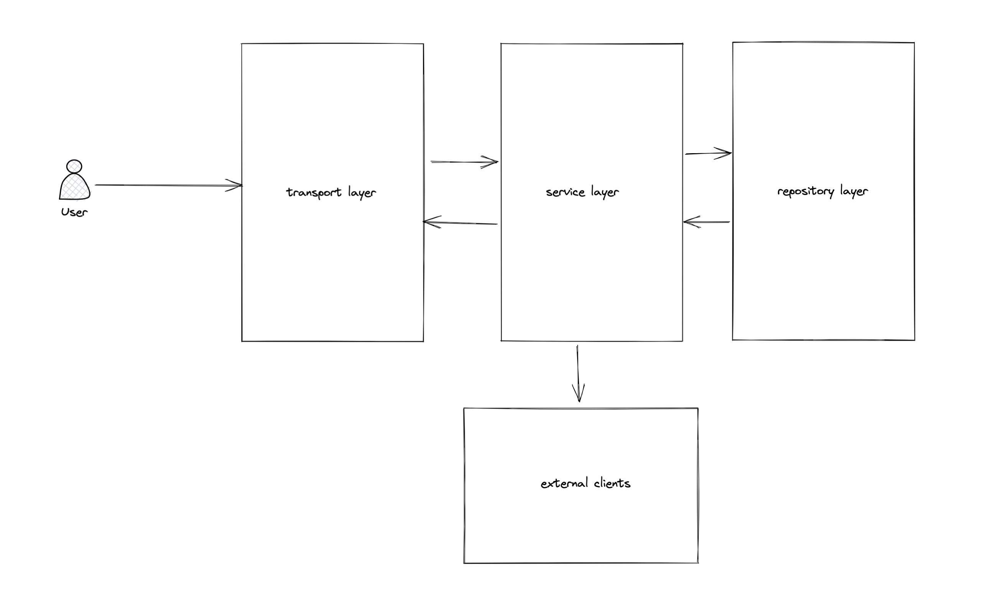

# Building a Production Ready REST API in Go - Course Materials

This repo contains all of the source code for my course - [Building a Production Ready REST API in Go](https://tutorialedge.net/courses/go-rest-api-course/).

> Join the TutorialEdge clan for the cost of $12.99 a month to gain access to all of the courses on the site - [Pricing](https://tutorialedge.net/pricing)

## Application Overview

I've designed the code in this course to follow clean architecture principles.

We'll be building a layered app with 3 distinct layers:

* **The Transport Layer** - responsible for handling incoming HTTP requests and passing them on to the relevant service functions.
* **The Service Layer** - responsible for all the business logic in your application.
* **The Repository Layer** - responsible for all the interactions with the database!

This ends up looking something like this:

## Technologies Used:

* **Postgres**
* **Docker + Docker-Compose**
* **Go** (This one was fairly obvious no?)
* **Postman** - for testing our service manually with HTTP request.

## Frameworks + Libraries Used

* **sqlx** - for simplifying our interactions with the database
* **golang-migrate** - for running our migrations on app startup
* **dgrijalva/jwt-go** - for working with JWTs in our transport layer.
* **satori/go.uuid** - for generating and working with UUIDs.
* **sirupsen/logrus** - nicer logging.
* **stretchr/testify** - For easier testing!

## Prerequisites

This course is designed to help teach you one approach for building and structuring a production-ready REST API in Go. It's designed for people with some Go already, I wont be covering the basic syntax for Go, but mostly focused on higher-level topics.

## Support 

Have any support issues or follow-up questions? Join us on the TutorialEdge Clan discord and get real-time support for all of your Go needs!
